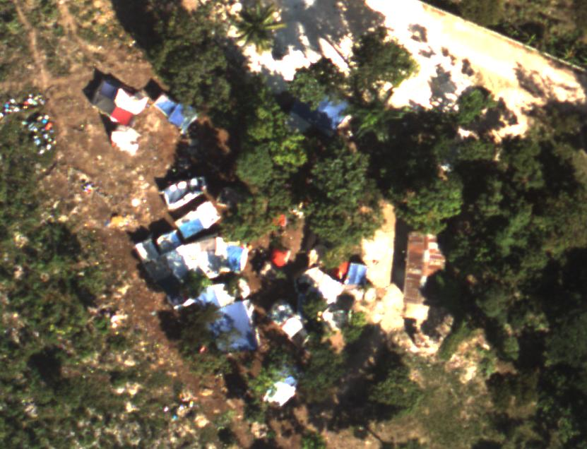

# Project Introduction 

On [January 12, 2010](en.wikipedia.org/wiki/2010_Haiti_earthquake), a magnitude 7.0 earthquake struck Haiti causing significant damage which affected approximately 3 million citizens. In the wake of the disaster, aid groups were working to locate displaced persons and provide them with food and water. However, due to the large scale destruction of infrastructure over a wide area additional assistance was needed to locate people quickly. 


)](Images/NPR_destruction.jpg)


Displaced persons were known to be making make-shift shelters out of blue tarps. High resolution geo-refereneced images were captured by aircraft of the destroyed areas. The data generated by the image collection was too large for aid workers to process in time to supply aid. Therefore, a team from the [Rochester Institute of Technology](https://www.rit.edu/news/rit-captures-haiti-disaster-high-tech-imaging-system) used data-mining algorithms to analyze the images and identify blue tarps. The goal was to effectively locate displaced persons and communicate their location to rescue workers so they could get resources to people who needed it in time.  



As the final project for SYS 6018 - Data Mining, we were assigned to build models from the different techniques we learned in the course to, as accurately as possible, and in as timely a manner as possible, locate as many of the displaced persons identified in the imagery data so that they could be provided food and water before their situations became unsurvivable.  The data made available to students consisted of a csv of red, green, blue pixel values and a class indicator which indicated if a pixel was representative of a blue tarp or something else like vegetation. A final hold-out data set  presented in the format of multiple text files was provided as well. 

# Project Budget

The US Government spent [$1.5B on Haiti disaster relief](https://www.rand.org/pubs/research_reports/RR304.html) by the end of 2010. For this project, we will assume that 5 million dollars were allocated to our team to deliver supplies to displaced individuals in the immediate aftermath. Our team has been assigned an area where 8,000 displaced people are expected to be. Anything less than a 85% delivery success rate will be considered a disaster relief failure. 90% of 8,000 people is 7,200.    

|                  |          |
|:----------------|:--------:|
|Budget           |$5,000,000|
|Cost per Delivery (True Positive)| -$1,000 | 
|Cost per Mis-Delivery (False Positive)| -$500 | 
|Cost per Missed Delivery (False Negative)| -$6,250 | 
|Cost per True Negative| $0|
 
```{r, echo=FALSE, message=FALSE}
TP_C = -1000
FP_C = -500
FN_C = -6250
```
 
* method of delivery
* cost of resources
* time from disaster to unsurvivable conditions 


# Data Exploration   

```{r, echo=FALSE, message=FALSE}
knitr::opts_chunk$set(error=TRUE,        # Keep compiling upon error
                      collapse=FALSE,    # collapse by default
                      echo=TRUE,         # echo code by default
                      comment = "#>",    # change comment character
                      fig.width = 7,     # set figure width
                      fig.align = "center",# set figure position
                      out.width = "75%", # set width of displayed images
                      warning=FALSE,     # do not show R warnings
                      message=FALSE)     # do not show R messages
```

```{r 1, echo=FALSE, message=FALSE, results='hide'}
library(tidyverse)
library(MASS)
library(ggplot2)
library(GGally)
library(caret)
library(pROC)
library(class)
library(stats)
library(ROCR)
library(randomForest)
library(e1071)
library(plotly)
library(tictoc)
```

```{r }
tic("Knit Time")
```

```{r cores, echo=FALSE, message=FALSE, results='hide'}
cores <- parallel::detectCores()
cores
```

```{r, echo=FALSE, message=FALSE, results='hide'}
all_cores <- parallel::detectCores(logical = FALSE)
all_cores
```

```{r, echo=FALSE, message=FALSE, results='hide'}
library(doParallel)
cl <- makePSOCKcluster(all_cores)
registerDoParallel(cl)
```

```{r, echo=FALSE, message=FALSE, results='hide'}
library(tune)
grid_control <- control_grid(verbose = TRUE,pkgs = "doParallel",allow_par = TRUE)
```

## {.tabset }

The data provided for analysis was generated from overhead images and stored as a three channel output. Each pixel also had a classifier label indicating whether it was a blue tarp or something else like vegetation or soil. The channels represented the red, green, and blue values for pixels within images. RGB color model is referred to as an additive model. The integer value for the red, green, and blue channels are combined to represent a color. Typically, the component values are stored as an 8 bit integer ranging from 0 to 255. 

### Check NA 

```{r 2,  results="hold"} 
df <- tibble(read.csv("HaitiPixels.csv")) #read in df
"Check for NA values" 
anyNA(df) #check for NA values 
"Summary of Data"
summary(df) #quick look at data
df$Class <- factor(df$Class) #make Class a factor variable. 
```


### Scatter and Correlation

```{r, message=FALSE}
#Reference [1]
# The palette with grey:
cbPalette <- c("#999999", "#E69F00", "#56B4E9", "#009E73",  "#CC79A7", "#0072B2", "#D55E00")
#"#F0E442",

#view scatter and correlations  
p <- ggpairs(df[,2:4], lower.panel = NULL, upper = list(continuous = wrap("cor", size = 3)), aes(color=df$Class)) #+ scale_fill_manual(values=cbPalette) 

#Reference: https://stackoverflow.com/questions/34740210/how-to-change-the-color-palette-for-ggallyggpairs/34743555
for(i in 1:p$nrow) {
  for(j in 1:p$ncol){
    p[i,j] <- p[i,j] + 
        scale_fill_manual(values=cbPalette) +
        scale_color_manual(values=cbPalette)  
  }
}

p

attach(df) #attach df variables 
```

### 3D Scatter

```{r}
fig <- plot_ly(df, x=~Red, y=~Green, z=~Blue, color=~Class, colors=c("#999999", "#E69F00", "#56B4E9", "#009E73",  "#CC79A7")) #Reference: https://plotly.com/r/3d-scatter-plots/ https://plotly.com/r/3d-surface-plots/
fig <- fig %>% add_markers()
fig <- fig %>% layout(scene=list(xaxis=list(title="Red"),
                     yaxis = list(title = 'Green'),
                     zaxis = list(title = 'Blue')))

fig
```

**!!!!!!!!!! IF I HAVE TIME MAKE A SELECTOR TO CHOOSE COLOR SCHEME FOR NOT COLOR BLIND OR DIFFERENT KINDS OF COLOR BLIND https://socviz.co/refineplots.html ** 

Initial inspection of the data frame indicated no missing values. The data provided is sufficiently cleaned only one further adjustment to the data frame is needed. Since our main interest is to predict whether a pixel represents a blue tarp or not a blue tarp, the Class column of the data frame needs to be converted into a binary indicator for blue tarp or not blue tarp. This is done in the next section.  

The data was visualized with the ggpairs function. For a pair of variables chosen from the data frame, [Ggpairs](https://www.r-graph-gallery.com/199-correlation-matrix-with-ggally.html#:~:text=The%20ggpairs()%20function%20of,left%20part%20of%20the%20figure.&text=Variable%20distribution%20is%20available%20on%20the%20diagonal.) generates a scatterplot, displays a Pearson correlation, and, on the diagonal, shows a variable distribution. The plots were also color-coded by class. The class label describes what kind of object a pixel is associated with. In our data frame there were the following classes: Blue Tarp, Rooftop, Soil, Various Non-tarp, and Vegetation. The 2D representation of the data only gives us a partial insight into the behavior and relationships of the predictors. Since three channels are used to generate a color, plotting the data in 3D to investigate trends and behavior between classes will be more meaningful. 

The 3D scatter plot shows a significant amount of overlap between the different classes. It is worth noting that it is possible to see some separation between the classes. 
\

## Prepare Data Frame for Analysis {.tabset }

\

### Data Frame

```{r 4,  results="hold"}
df <- cbind(mutate(df, "Blue_Tarp_or_Not"=ifelse(Class != "Blue Tarp", 0, 1))) #add binary column indicating whether the Class variable is "Blue Tarp" or not
attach(df)
df$Blue_Tarp_or_Not <- factor(Blue_Tarp_or_Not, labels = c("NBT", "BT"))#, levels =c(0,1), labels = c("NBT", "BT")) #ensure new column is a factor 
"First Six Rows of Data Frame"
head(df)
df_factor  <- df[, -1]
"Last Six Rows of Data Frame"
tail(df_factor)
attach(df_factor)
```


### 3D Scatter - Binary

```{r}
fig1 <- plot_ly(df_factor, x=~Red, y=~Green, z=~Blue, color=~Blue_Tarp_or_Not, colors = cbPalette) #Reference: https://plotly.com/r/3d-scatter-plots/ https://plotly.com/r/3d-surface-plots/
fig1 <- fig1 %>% add_markers()
fig1 <- fig1 %>% layout(scene=list(xaxis=list(title="Red"),
                     yaxis = list(title = 'Green'),
                     zaxis = list(title = 'Blue')))

fig1
```

After the class label is converted into a binary classifier, it is easier to see separation between the data points for blue tarps and not blue tarps. 


```{r Data Subset for Quick Runs, eval=FALSE, echo=FALSE}
set.seed(4)
#In order to make run times faster when tuning parameters subset data with 20%
trainIndex <- createDataPartition(df_factor$Blue_Tarp_or_Not, p=0.2,
                                  list=FALSE,
                                  times=1)
df_subset <- df_factor[trainIndex,]
```


# Model Fitting

## Logistic Regression {.tabset }

Fit a Logistic Regression Model ....

### Model 

```{r Log Reg, message=FALSE, warning=FALSE,  results="hold"}
#pass
fitControl <- trainControl(method = "cv",
                           number = 10,
                           returnResamp = 'all',
                           savePredictions = 'final',
                           classProbs = TRUE) 

set.seed(4)
tic("Log. Reg.")
glm.fit <- caret::train(Blue_Tarp_or_Not~Red+Green+Blue,
                    data = df_factor,
                    method="glm",
                    family="binomial",
                    trControl= fitControl)
glm.time <- toc(quiet = TRUE)
glm.fit

"Summary"
summary(glm.fit)

```

### ROC

Test model performance on Train data to select threshold values... 
```{r Log Reg pred,  results="hold"}
#pass
glm.prob <- predict(glm.fit, newdata=df_factor , type = "prob") #returns df with col 0 (prob not blue tarp) and 1 (prob blue tarp)
par(pty="s")
glm_roc <- roc(df_factor $Blue_Tarp_or_Not, glm.prob[,2], plot=TRUE, legacy.axes=TRUE, percent=TRUE, xlab="False Positive Percentage", ylab="True Positive Percentage", col="#0072B2", lwd=4, print.auc=TRUE, main="Log. Reg. ROC Curve") 
```

### Thresholds

```{r LR Thresholds,  results="hold"}
roc.info_glm <- roc(df_factor$Blue_Tarp_or_Not, glm.prob[,2], legacy.axes=TRUE)
roc.glm.df <- data.frame(tpp=roc.info_glm$sensitivities*100, fpp=(1-roc.info_glm$specificities)*100, thresholds=roc.info_glm$thresholds)
#roc.glm.df[roc.glm.df>98.5 & roc.glm.df < 99,]

glm.thresholds <- data.matrix(roc.glm.df$thresholds)

fig2 <- plot_ly(roc.glm.df, x=~tpp, y=~fpp, z=~thresholds, colors = "#0072B2") #Reference: https://plotly.com/r/3d-scatter-plots/ https://plotly.com/r/3d-surface-plots/
fig2 <- fig2 %>% add_markers()
fig2 <- fig2 %>% layout(scene=list(xaxis=list(title="True Positive Rate"),
                     yaxis = list(title = 'False Positive Rate'),
                     zaxis = list(title = 'Threshold')))

fig2
```

```{r decisions, eval=FALSE}

Confusion_Matrix <- set_names(seq(0.01,0.99,0.01)) %>% 
  map( ~ Blue_Tarp_or_Not(factor(ifelse(synth_dat$p>=.x,'T','F')), factor(synth_dat$y)))

Cost_Benefit_Matrix <- matrix(c(0,-5000,-300,-1000), nrow=2, ncol=2, byrow=TRUE)
  
Cost <- Confusion_Matrix %>%
  map( ~ sum(.x * Cost_Benefit_Matrix))

Cost_actual <- Confusion_Matrix %>%
  map( ~ sum((.x*Cost_Benefit_Matrix)[2,]))

tibble(threshold=as.numeric(names(Cost)), 
       cost=unlist(Cost), cost_actual=unlist(Cost_actual)) %>%
  ggplot() + geom_line(aes(x=threshold, y=cost, color='perceived'), size=3) +
  geom_line(aes(x=threshold, y=cost_actual, color='actual'), 
            size=2, linetype='dotted') +
  ylim(c(-4000000,0)) + scale_fill_manual(values=c('forestgreen','purple')) +
  geom_abline(slope=0, intercept=-2000000)
```


### Confusion Matrix

```{r Log Reg Confusion Matrix,  results="hold"}
lr.thresh <- 0.003
glm.pred_thresh <- factor(ifelse(glm.prob[,2]>lr.thresh,"BT", "NBT"), levels=c("NBT", "BT"))
cm.glm_thresh <- confusionMatrix(factor(glm.pred_thresh),df_factor $Blue_Tarp_or_Not, positive = "BT") 
"Threshold:"
lr.thresh
cm.glm_thresh

acc_LR <- cm.glm_thresh[["overall"]][["Accuracy"]]*100
auc_LR <- glm_roc[["auc"]]
thresh_LR <- lr.thresh
sens_LR <-  cm.glm_thresh[["byClass"]][["Sensitivity"]]*100
spec_LR <- cm.glm_thresh[["byClass"]][["Specificity"]]*100
FDR_LR <- ((cm.glm_thresh[["table"]][2,1])/(cm.glm_thresh[["table"]][2,1]+cm.glm_thresh[["table"]][2,2]))*100
prec_LR <- cm.glm_thresh[["byClass"]][["Precision"]]*100

cost.glm <- cm.glm_thresh[["table"]][1]*0 + cm.glm_thresh[["table"]][2]*FP_C + cm.glm_thresh[["table"]][3]*FN_C + cm.glm_thresh[["table"]][4]*TP_C
cost.glm
```
### Sampling Variability 

```{r LR Sampling Variablity,  results="hold" }
"10 Fold Results"
glm.fit$resample #point est +/- std from 10 folds "variation in the third decimal place"... 
glm.sd <- sd(glm.fit[["resample"]][["Accuracy"]]*100)
#plot(glm.fit[["resample"]][["Accuracy"]], main="Accuracy per Fold", xlab= "Fold Number", ylab="Accuracy")
```
The average accuracy across ten folds is `r round(acc_LR, 2)` with a standard deviation of `r round(glm.sd, 3)`.  

## LDA {.tabset }

### Model

```{r LDA,  results="hold"}
#pass
fitControl <- trainControl(method = "cv",
                           number = 10,
                           returnResamp = 'all',
                           savePredictions = 'final',
                           classProbs = TRUE)

set.seed(4)
tic("LDA")
lda.fit <- caret::train(Blue_Tarp_or_Not~Red+Green+Blue,
                    data = df_factor,
                    preProcess=c("center","scale"),
                    method="lda",
                    verbose= FALSE,
                    trControl= fitControl)
lda.time <- toc(quiet = TRUE)
lda.fit
```

### ROC 

```{r LDA pred,  results="hold"}
#pass
lda.prob <- predict(lda.fit, newdata=df_factor, type = "prob") #returns df with col 0 (prob not blue tarp) and 1 (prob blue tarp)
par(pty="s")
lda_roc <- roc(df_factor$Blue_Tarp_or_Not, lda.prob[,2], plot=TRUE, legacy.axes=TRUE, percent=TRUE, xlab="False Positive Percentage", ylab="True Positive Percentage", col="#0072B2", lwd=4, print.auc=TRUE, main="LDA ROC Curve") 
```

### Thresholds

```{r LDA Thresholds,  results="hold"}
roc.info_lda <- roc(df_factor $Blue_Tarp_or_Not, lda.prob[,2], legacy.axes=TRUE)
roc.lda.df <- data.frame(tpp=roc.info_lda$sensitivities*100, fpp=(1-roc.info_lda$specificities)*100, thresholds=roc.info_lda$thresholds)
#roc.lda.df[roc.lda.df>91.5 & roc.lda.df < 91.6,]

fig3 <- plot_ly(roc.lda.df, x=~tpp, y=~fpp, z=~thresholds, colors = "#0072B2") #Reference: https://plotly.com/r/3d-scatter-plots/ https://plotly.com/r/3d-surface-plots/
fig3 <- fig3 %>% add_markers()
fig3 <- fig3 %>% layout(scene=list(xaxis=list(title="True Positive Rate"),
                     yaxis = list(title = 'False Positive Rate'),
                     zaxis = list(title = 'Threshold')))

fig3
```

### Confusion Matrix 

```{r LDA Confusion Matrix,  results="hold"}
lda.thresh <- 0.0008

lda.pred_thresh <- factor(ifelse(lda.prob[,2]>lda.thresh,"BT", "NBT"), levels=c("NBT", "BT"))
cm.lda_thresh <- confusionMatrix(factor(lda.pred_thresh),df_factor$Blue_Tarp_or_Not, positive = "BT") 
"Threshold:"
lda.thresh
cm.lda_thresh

acc_lda <- cm.lda_thresh[["overall"]][["Accuracy"]]*100
auc_lda <- lda_roc[["auc"]]
thresh_lda <- lda.thresh
sens_lda <-  cm.lda_thresh[["byClass"]][["Sensitivity"]]*100
spec_lda <- cm.lda_thresh[["byClass"]][["Specificity"]]*100
FDR_lda <- ((cm.lda_thresh[["table"]][2,1])/(cm.lda_thresh[["table"]][2,1]+cm.lda_thresh[["table"]][2,2]))*100
prec_lda <- cm.lda_thresh[["byClass"]][["Precision"]]*100

cost.lda <- cm.lda_thresh[["table"]][1]*0 + cm.lda_thresh[["table"]][2]*FP_C + cm.lda_thresh[["table"]][3]*FN_C + cm.lda_thresh[["table"]][4]*TP_C
cost.lda
```

### Sampling Variability 

```{r LDA Sampling Variablity,  results="hold" }
"10 Fold Results"
lda.fit$resample  
lda.sd <- sd(lda.fit[["resample"]][["Accuracy"]]*100)
```
The average accuracy across ten folds is `r round(acc_lda, 2)` with a standard deviation of `r round(lda.sd, 3)`.  

## QDA {.tabset }

### Model

```{r QDA,  results="hold"}
#pass
fitControl <- trainControl(method = "cv",
                           number = 10,
                           returnResamp = 'all',
                           savePredictions = 'final',
                           classProbs = TRUE)

set.seed(4)
tic("QDA")
qda.fit <- caret::train(Blue_Tarp_or_Not~Red+Green+Blue,
                    data = df_factor,
                    preProcess=c("center","scale"),
                    method="qda",
                    verbose= FALSE,
                    trControl= fitControl)
qda.time <- toc(quiet = TRUE)
qda.fit
```

### ROC 

```{r QDA pred,  results="hold"}
#pass
qda.prob <- predict(qda.fit, newdata=df_factor , type = "prob") #returns df with col 0 (prob not blue tarp) and 1 (prob blue tarp)
par(pty="s")
qda_roc <- roc(df_factor $Blue_Tarp_or_Not, qda.prob[,2], plot=TRUE, legacy.axes=TRUE, percent=TRUE, xlab="False Positive Percentage", ylab="True Positive Percentage", col="#0072B2", lwd=4, print.auc=TRUE, main="QDA ROC Curve") 
```

### Thresholds 

```{r QDA Thresholds,  results="hold"}
roc.info_qda <- roc(df_factor$Blue_Tarp_or_Not, qda.prob[,2], legacy.axes=TRUE)
roc.qda.df <- data.frame(tpp=roc.info_qda$sensitivities*100, fpp=(1-roc.info_qda$specificities)*100, thresholds=roc.info_qda$thresholds)
#roc.qda.df[roc.qda.df>98 & roc.qda.df < 99,]

fig4 <- plot_ly(roc.qda.df, x=~tpp, y=~fpp, z=~thresholds, colors = "#0072B2") #Reference: https://plotly.com/r/3d-scatter-plots/ https://plotly.com/r/3d-surface-plots/
fig4 <- fig4 %>% add_markers()
fig4 <- fig4 %>% layout(scene=list(xaxis=list(title="True Positive Rate"),
                     yaxis = list(title = 'False Positive Rate'),
                     zaxis = list(title = 'Threshold')))

fig4
```

### Confusion Matrix 

```{r QDA Confusion Matrix,  results="hold"}
qda.thresh <- 0.0016
qda.pred_thresh <- factor(ifelse(qda.prob[,2]>qda.thresh,"BT", "NBT"), levels=c("NBT", "BT"))
cm.qda_thresh <- confusionMatrix(factor(qda.pred_thresh),df_factor $Blue_Tarp_or_Not, positive = "BT") 
"Threshold:"
qda.thresh
cm.qda_thresh

acc_qda <- cm.qda_thresh[["overall"]][["Accuracy"]]*100
auc_qda <- qda_roc[["auc"]]
thresh_qda <- qda.thresh
sens_qda <-  cm.qda_thresh[["byClass"]][["Sensitivity"]]*100
spec_qda <- cm.qda_thresh[["byClass"]][["Specificity"]]*100
FDR_qda <- ((cm.qda_thresh[["table"]][2,1])/(cm.qda_thresh[["table"]][2,1]+cm.qda_thresh[["table"]][2,2]))*100
prec_qda <- cm.qda_thresh[["byClass"]][["Precision"]]*100

cost.qda <- cm.qda_thresh[["table"]][1]*0 + cm.qda_thresh[["table"]][2]*FP_C + cm.qda_thresh[["table"]][3]*FN_C + cm.qda_thresh[["table"]][4]*TP_C
cost.qda
```

### Sampling Variability 

```{r QDA Sampling Variablity,  results="hold" }
"10 Fold Results"
qda.fit$resample #point est +/- std from 10 folds "variation in the third decimal place"... 
qda.sd <- sd(qda.fit[["resample"]][["Accuracy"]]*100)

```
The average accuracy across ten folds is `r round(acc_qda, 2)` with a standard deviation of `r round(qda.sd, 3)`.  

## KNN {.tabset }

### Model 

```{r KNN,  results="hold"}
#pass
fitControl <- trainControl(method = "cv",
                           number = 10,
                           returnResamp = 'all',
                           savePredictions = 'final',
                           classProbs = TRUE)

set.seed(4)
tic("KNN")
knn.fit <- train(Blue_Tarp_or_Not~Red+Green+Blue,
                    data = df_factor,
                    preProcess=c("center","scale"),
                    method="knn",
                    trControl= fitControl,
                    tuneLength=10
                    )
knn.time <- toc(quiet = TRUE)
knn.fit

```

```{r}
plot(knn.fit)
```


### ROC

```{r KNN pred,  results="hold"}
#pass
knn.prob <- predict(knn.fit, newdata=df_factor , type = "prob") #returns df with col 0 (prob not blue tarp) and 1 (prob blue tarp)
par(pty="s")
knn_roc <- roc(df_factor $Blue_Tarp_or_Not, knn.prob[,2], plot=TRUE, legacy.axes=TRUE, percent=TRUE, xlab="False Positive Percentage", ylab="True Positive Percentage", col="#0072B2", lwd=4, print.auc=TRUE, main="KNN ROC Curve") 
```

### Thresholds 

Not sure why there are only 10 values for this one...? 

```{r KNN Thresholds,  results="hold"}
roc.info_knn <- roc(df_factor$Blue_Tarp_or_Not, knn.prob[,2], legacy.axes=TRUE)
roc.knn.df <- data.frame(tpp=roc.info_knn$sensitivities*100, fpp=(1-roc.info_knn$specificities)*100, thresholds=roc.info_knn$thresholds)
#roc.knn.df[roc.knn.df>99 & roc.knn.df < 100,]
#roc.knn.df

fig5 <- plot_ly(roc.knn.df, x=~tpp, y=~fpp, z=~thresholds, colors = "#0072B2") #Reference: https://plotly.com/r/3d-scatter-plots/ https://plotly.com/r/3d-surface-plots/
fig5 <- fig5 %>% add_markers()
fig5 <- fig5 %>% layout(scene=list(xaxis=list(title="True Positive Rate"),
                     yaxis = list(title = 'False Positive Rate'),
                     zaxis = list(title = 'Threshold')))

fig5
```

### Confusion Matrix 

```{r KNN Confusion Matrix,  results="hold"}
knn.thresh <- 0.035
knn.pred_thresh <- factor(ifelse(knn.prob[,2]>knn.thresh,"BT", "NBT"), levels=c("NBT", "BT"))
cm.knn_thresh <- confusionMatrix(factor(knn.pred_thresh),df_factor $Blue_Tarp_or_Not, positive = "BT") 
"Threshold:"
knn.thresh
cm.knn_thresh

acc_knn <- cm.knn_thresh[["overall"]][["Accuracy"]]*100
auc_knn <- knn_roc[["auc"]]
thresh_knn <- knn.thresh
sens_knn <-  cm.knn_thresh[["byClass"]][["Sensitivity"]]*100
spec_knn <- cm.knn_thresh[["byClass"]][["Specificity"]]*100
FDR_knn <- ((cm.knn_thresh[["table"]][2,1])/(cm.knn_thresh[["table"]][2,1]+cm.knn_thresh[["table"]][2,2]))*100
prec_knn <- cm.knn_thresh[["byClass"]][["Precision"]]*100
k_knn <- knn.fit[["bestTune"]][["k"]]

cost.knn <- cm.knn_thresh[["table"]][1]*0 + cm.knn_thresh[["table"]][2]*FP_C + cm.knn_thresh[["table"]][3]*FN_C + cm.knn_thresh[["table"]][4]*TP_C
cost.knn
```
### Sampling Variability 

```{r KNN Sampling Variablity,  results="hold" }
"10 Fold Results"
knn.fit$resample #point est +/- std from 10 folds "variation in the third decimal place"... 
knn.sd <- sd(knn.fit[["resample"]][["Accuracy"]]*100)

```
The average accuracy across ten folds when k = `r k_knn` is `r round(acc_knn, 2)` with a standard deviation of `r round(knn.sd, 3)`.  


## Random Forest {.tabset }

### Model 

```{r Random Forest,  results="hold"}
#pass
fitControl <- trainControl(method = "cv",
                           number = 10,
                           returnResamp = 'all',
                           savePredictions = 'final',
                           classProbs = TRUE)

set.seed(4)
tic("RF")
rf.fit <- train(Blue_Tarp_or_Not~Red+Green+Blue,
                    data = df_factor,
                    preProcess=c("center","scale"),
                    method="rf", #what is the difference between the different caret rf models??
                    trControl= fitControl,
                    tuneLength=3
                    )
rf.time <- toc(quiet = TRUE)
rf.fit

```

```{r}
plot(rf.fit)
```

### ROC 

```{r RF pred,  results="hold"}
#pass
RF.prob <- predict(rf.fit, newdata=df_factor , type = "prob") #returns df with col 0 (prob not blue tarp) and 1 (prob blue tarp)
par(pty="s")
RF_roc <- roc(df_factor $Blue_Tarp_or_Not, RF.prob[,2], plot=TRUE, legacy.axes=TRUE, percent=TRUE, xlab="False Positive Percentage", ylab="True Positive Percentage", col="#0072B2", lwd=4, print.auc=TRUE, main="RF ROC Curve") 
```

### Thresholds 

```{r RF Thresholds,  results="hold"}
roc.info_rf <- roc(df_factor$Blue_Tarp_or_Not, RF.prob[,2], legacy.axes=TRUE)
roc.rf.df <- data.frame(tpp=roc.info_rf$sensitivities*100, fpp=(1-roc.info_rf$specificities)*100, thresholds=roc.info_rf$thresholds)
#roc.rf.df[roc.rf.df>99 & roc.rf.df < 100,]
#roc.rf.df

fig6 <- plot_ly(roc.rf.df, x=~tpp, y=~fpp, z=~thresholds, colors = "#0072B2") #Reference: https://plotly.com/r/3d-scatter-plots/ https://plotly.com/r/3d-surface-plots/
fig6 <- fig6 %>% add_markers()
fig6 <- fig6 %>% layout(scene=list(xaxis=list(title="True Positive Rate"),
                     yaxis = list(title = 'False Positive Rate'),
                     zaxis = list(title = 'Threshold')))

fig6
```

### Confusion Matrix 

```{r RF Confusion Matrix,  results="hold"}
RF.thresh <- 0.45
RF.pred_thresh <- factor(ifelse(RF.prob[,2]>RF.thresh,"BT", "NBT"), levels=c("NBT", "BT"))
cm.RF_thresh <- confusionMatrix(factor(RF.pred_thresh),df_factor $Blue_Tarp_or_Not, positive = "BT") 
"Threshold:"
RF.thresh
cm.RF_thresh

acc_RF <- cm.RF_thresh[["overall"]][["Accuracy"]]*100
auc_RF <- RF_roc[["auc"]]
thresh_RF <- RF.thresh
sens_RF <-  cm.RF_thresh[["byClass"]][["Sensitivity"]]*100
spec_RF <- cm.RF_thresh[["byClass"]][["Specificity"]]*100
FDR_RF <- ((cm.RF_thresh[["table"]][2,1])/(cm.RF_thresh[["table"]][2,1]+cm.RF_thresh[["table"]][2,2]))*100
prec_RF <- cm.RF_thresh[["byClass"]][["Precision"]]*100
mtry_best <- rf.fit[["bestTune"]][["mtry"]]
ntree <- rf.fit[["finalModel"]][["ntree"]]

cost.RF <- cm.RF_thresh[["table"]][1]*0 + cm.RF_thresh[["table"]][2]*FP_C + cm.RF_thresh[["table"]][3]*FN_C + cm.RF_thresh[["table"]][4]*TP_C
cost.RF
```
### Sampling Variability 

```{r RF Sampling Variablity,  results="hold" }
"10 Fold Results"
rf.fit$resample #point est +/- std from 10 folds "variation in the third decimal place"... 
rf.sd <- sd(rf.fit[["resample"]][["Accuracy"]]*100)

```
The average accuracy across ten folds when mtry = `r mtry_best`  is `r round(acc_RF, 2)` with a standard deviation of `r round(rf.sd, 3)`.  

## SVM {.tabset }

### Model 

```{r SVM Radial,  results="hold"}
#pass
fitControl <- trainControl(method = "cv",
                           number = 10,
                           returnResamp = 'all',
                           savePredictions = 'final',
                           classProbs = TRUE)

set.seed(4)
tic("SVM")
svm.radial.fit <- train(Blue_Tarp_or_Not~Red+Green+Blue,
                    data = df_factor,
                    preProcess=c("center","scale"),
                    method="svmRadial",
                    trControl= fitControl,
                    tuneLength=10
                    #tuneGrid = expand.grid(C=seq(0,10, length=10),
                    #                           sigma =seq(0,10, length=10))
                    )
svm.time <- toc(quiet = TRUE)
svm.radial.fit
"Summary"
summary(svm.radial.fit)

 
```

```{r}
plot(svm.radial.fit)

```


Both linear and poly SVM functions were considered. Radial SVM produced the highest accuracy values of the three methods. SVM radial was chosen for building the SVM model. 

### ROC 

```{r SVM pred,  results="hold"}
#pass
SVM.prob <- predict(svm.radial.fit, newdata=df_factor , type = "prob") #returns df with col 0 (prob not blue tarp) and 1 (prob blue tarp)
par(pty="s")
SVM_roc <- roc(df_factor $Blue_Tarp_or_Not, SVM.prob[,2], plot=TRUE, legacy.axes=TRUE, percent=TRUE, xlab="False Positive Percentage", ylab="True Positive Percentage", col="#0072B2", lwd=4, print.auc=TRUE, main="SVM ROC Curve") 
```

### Thresholds

```{r SVM Thresholds,  results="hold"}
roc.info_svm <- roc(df_factor$Blue_Tarp_or_Not, SVM.prob[,2], legacy.axes=TRUE)
roc.svm.df <- data.frame(tpp=roc.info_svm$sensitivities*100, fpp=(1-roc.info_svm$specificities)*100, thresholds=roc.info_svm$thresholds)
#roc.svm.df[roc.svm.df>99 & roc.svm.df < 100,]
#roc.svm.df

fig7 <- plot_ly(roc.svm.df, x=~tpp, y=~fpp, z=~thresholds, colors = "#0072B2") #Reference: https://plotly.com/r/3d-scatter-plots/ https://plotly.com/r/3d-surface-plots/
fig7 <- fig7 %>% add_markers()
fig7 <- fig7 %>% layout(scene=list(xaxis=list(title="True Positive Rate"),
                     yaxis = list(title = 'False Positive Rate'),
                     zaxis = list(title = 'Threshold')))

fig7
```

### Confusion Matrix 

```{r SVM Confusion Matrix,  results="hold"}
SVM.thresh <- 0.0017
SVM.pred_thresh <- factor(ifelse(SVM.prob[,2]>SVM.thresh,"BT", "NBT"), levels=c("NBT", "BT"))
cm.SVM_thresh <- confusionMatrix(factor(SVM.pred_thresh),df_factor $Blue_Tarp_or_Not, positive = "BT") 
"Threshold:"
SVM.thresh
cm.SVM_thresh

acc_SVM <- cm.SVM_thresh[["overall"]][["Accuracy"]]*100
auc_SVM <- SVM_roc[["auc"]]
thresh_SVM <- SVM.thresh
sens_SVM <-  cm.SVM_thresh[["byClass"]][["Sensitivity"]]*100
spec_SVM <- cm.SVM_thresh[["byClass"]][["Specificity"]]*100
FDR_SVM <- ((cm.SVM_thresh[["table"]][2,1])/(cm.SVM_thresh[["table"]][2,1]+cm.SVM_thresh[["table"]][2,2]))*100
prec_SVM <- cm.SVM_thresh[["byClass"]][["Precision"]]*100
sigma_best <- round(svm.radial.fit[["bestTune"]][["sigma"]], 4)
C_best <- svm.radial.fit[["bestTune"]][["C"]]

cost.SVM <- cm.SVM_thresh[["table"]][1]*0 + cm.SVM_thresh[["table"]][2]*FP_C + cm.SVM_thresh[["table"]][3]*FN_C + cm.SVM_thresh[["table"]][4]*TP_C
cost.SVM
```
### Sampling Variability 

```{r SVM Sampling Variablity,  results="hold" }
"10 Fold Results"
svm.radial.fit$resample #point est +/- std from 10 folds "variation in the third decimal place"... 
svm.sd <- sd(svm.radial.fit[["resample"]][["Accuracy"]]*100)

```
The average accuracy across ten folds is `r round(acc_SVM, 2)` with a standard deviation of `r round(svm.sd, 3)`.  

## K-Folds Out of Sampling Performance 

### Table 2 - Performance Summary


#### **Performance Metrics: 10-Fold Cross-Validation Metrics**

|      Method | KNN (k = `r k_knn`) |    LDA    |    QDA    | Log. Regression | Random Forest (mtry = `r mtry_best`, nTrees = `r ntree`) | SVM (sigma = `r sigma_best`, C = `r C_best`)|
|------------:|:----------------:|:---------:|:---------:|:---------------:|:--------------:|:--------------:|
|    Accuracy | `r round(acc_knn,2)`%   | `r round(acc_lda,2)`%   | `r round(acc_qda,2)`%   | `r round(acc_LR,2)`%  | `r round(acc_RF,2)`%| `r round(acc_SVM,2)`%   |
|         AUC | `r round(auc_knn,2)`%   | `r round(auc_lda,2)`%   | `r round(auc_qda,2)`%   | `r round(auc_LR,2)`%  | `r round(auc_RF,2)`%| `r round(auc_SVM,2)`%   |
|         ROC |                         |                         |                         |                       |                    |                        |
|   Threshold | `r round(thresh_knn,5)` | `r round(thresh_lda,5)` | `r round(thresh_qda,5)` | `r round(thresh_LR,5)`| `r round(thresh_RF,5)`|`r round(thresh_SVM,5)`|
| Sensitivity | `r round(sens_knn,2)`%  | `r round(sens_lda,2)`%  | `r round(sens_qda,2)`%  | `r round(sens_LR,2)`% |`r round(sens_RF,2)`%| `r round(sens_SVM,2)`%  |
| Specificity | `r round(spec_knn,2)`%  | `r round(spec_lda,2)`%  | `r round(spec_qda,2)`%  | `r round(spec_LR,2)`% |`r round(spec_RF,2)`%|`r round(spec_SVM,2)`%   |
|         FDR | `r round(FDR_knn,2)`%   | `r round(FDR_lda,2)`%   | `r round(FDR_qda,2)`%   | `r round(FDR_LR,2)`%  | `r round(FDR_RF,2)`%|`r round(FDR_SVM,2)`%    |
|   Precision | `r round(prec_knn,2)`%  | `r round(prec_lda,2)`%  | `r round(prec_qda,2)`%  | `r round(prec_LR,2)`% |`r round(prec_RF,2)`%| `r round(prec_SVM,2)`%  |
|        Cost | ` r cost.knn`           | ` r cost.lda`           | `r cost.qda`            | ` r cost.glm`         | ` r cost.RF `       | ` r cost.SVM`

Model performance based on running training data through the fitted model. ~**Make some comments here about variation between folds**~ 

# Model Performance 

## Hold-Out Test Sample Performance {.tabset}

```{r Load FHO Data}
df_FHO <- tibble(read.csv("SYS6018_FHO_Data.csv"))
df_FHO$Blue_Tarp_or_Not <- factor(df_FHO$Blue_Tarp_or_Not, labels = c("NBT", "BT"))
df_FHO
```


### Logistic Regression 

```{r FHO LR, results="hold"}
tic("Log.Reg. Predict")
glm.prob_FHO <- predict(glm.fit, newdata=df_FHO , type = "prob") #returns df with col 0 (prob not blue tarp) and 1 (prob blue tarp)
glm.predict.time <- toc(quiet = TRUE)

lr.thresh_FHO <- lr.thresh
glm.pred_thresh_FHO <- factor(ifelse(glm.prob_FHO[,2]>lr.thresh_FHO,"BT", "NBT"), levels=c("NBT", "BT"))
cm.glm_thresh_FHO <- confusionMatrix(factor(glm.pred_thresh_FHO),df_FHO$Blue_Tarp_or_Not, positive = "BT") 
"Threshold:" 
lr.thresh_FHO
cm.glm_thresh_FHO

acc_LR_FHO <- round(cm.glm_thresh_FHO[["overall"]][["Accuracy"]]*100, 2)
auc_LR_FHO <- round(glm_roc[["auc"]], 2)
thresh_LR_FHO <- lr.thresh_FHO
sens_LR_FHO <-  round(cm.glm_thresh_FHO[["byClass"]][["Sensitivity"]]*100, 2)
spec_LR_FHO <- round(cm.glm_thresh_FHO[["byClass"]][["Specificity"]]*100, 2)
FDR_LR_FHO <- round(((cm.glm_thresh_FHO[["table"]][2,1])/(cm.glm_thresh_FHO[["table"]][2,1]+cm.glm_thresh_FHO[["table"]][2,2]))*100, 2)
prec_LR_FHO <- round(cm.glm_thresh_FHO[["byClass"]][["Precision"]]*100, 2)

```

### LDA 

```{r FHO LDA, results="hold"}
tic("LDA Predict")
lda.prob_FHO <- predict(lda.fit, newdata=df_FHO, type = "prob") #returns df with col 0 (prob not blue tarp) and 1 (prob blue tarp)
lda.predict.time <- toc(quiet = TRUE)

lda.thresh_FHO <- lda.thresh
lda.pred_thresh_FHO <- factor(ifelse(lda.prob_FHO[,2]>lda.thresh_FHO,"BT", "NBT"), levels=c("NBT", "BT"))
cm.lda_thresh_FHO <- confusionMatrix(factor(lda.pred_thresh_FHO),df_FHO$Blue_Tarp_or_Not, positive = "BT") 
"Threshold:" 
lda.thresh_FHO
cm.lda_thresh_FHO

acc_lda_FHO <- round(cm.lda_thresh_FHO[["overall"]][["Accuracy"]]*100, 2)
auc_lda_FHO <- round(lda_roc[["auc"]],2)
thresh_lda_FHO <- lda.thresh_FHO
sens_lda_FHO <-  round(cm.lda_thresh_FHO[["byClass"]][["Sensitivity"]]*100,2)
spec_lda_FHO <- round(cm.lda_thresh_FHO[["byClass"]][["Specificity"]]*100,2)
FDR_lda_FHO <- round(((cm.lda_thresh_FHO[["table"]][2,1])/(cm.lda_thresh_FHO[["table"]][2,1]+cm.lda_thresh_FHO[["table"]][2,2]))*100,2)
prec_lda_FHO <- round(cm.lda_thresh_FHO[["byClass"]][["Precision"]]*100, 2)
```


### QDA 

```{r FHO qDA, results="hold"}
tic("QDA Predict")
qda.prob_FHO <- predict(qda.fit, newdata=df_FHO , type = "prob") #returns df with col 0 (prob not blue tarp) and 1 (prob blue tarp)
qda.predict.time <- toc(quiet = TRUE)

qda.thresh_FHO <- qda.thresh
qda.pred_thresh_FHO <- factor(ifelse(qda.prob_FHO[,2]>qda.thresh_FHO,"BT", "NBT"), levels=c("NBT", "BT"))
cm.qda_thresh_FHO <- confusionMatrix(factor(qda.pred_thresh_FHO),df_FHO$Blue_Tarp_or_Not, positive = "BT") 
"Threshold:" 
qda.thresh_FHO
cm.qda_thresh_FHO

acc_qda_FHO <- round(cm.qda_thresh_FHO[["overall"]][["Accuracy"]]*100,2)
auc_qda_FHO <- round(qda_roc[["auc"]],2)
thresh_qda_FHO <- qda.thresh_FHO
sens_qda_FHO <-  round(cm.qda_thresh_FHO[["byClass"]][["Sensitivity"]]*100,2)
spec_qda_FHO <- round(cm.qda_thresh_FHO[["byClass"]][["Specificity"]]*100,2)
FDR_qda_FHO <- round(((cm.qda_thresh_FHO[["table"]][2,1])/(cm.qda_thresh_FHO[["table"]][2,1]+cm.qda_thresh_FHO[["table"]][2,2]))*100,2)
prec_qda_FHO <- round(cm.qda_thresh_FHO[["byClass"]][["Precision"]]*100,2)
```

### KNN

```{r FHO KNN, results="hold"}
tic("KNN Predict")
knn.prob_FHO <- predict(knn.fit, newdata=df_FHO , type = "prob") #returns df with col 0 (prob not blue tarp) and 1 (prob blue tarp)
knn.predict.time <- toc(quiet = TRUE)

knn.thresh_FHO <- knn.thresh
knn.pred_thresh_FHO <- factor(ifelse(knn.prob_FHO[,2]>knn.thresh_FHO,"BT", "NBT"), levels=c("NBT", "BT"))
cm.knn_thresh_FHO <- confusionMatrix(factor(knn.pred_thresh_FHO),df_FHO$Blue_Tarp_or_Not, positive = "BT") 
"Threshold:" 
knn.thresh_FHO
cm.knn_thresh_FHO

acc_knn_FHO <- round(cm.knn_thresh_FHO[["overall"]][["Accuracy"]]*100,2)
auc_knn_FHO <- round(knn_roc[["auc"]],2)
thresh_knn_FHO <- knn.thresh_FHO
sens_knn_FHO <-  round(cm.knn_thresh_FHO[["byClass"]][["Sensitivity"]]*100,2)
spec_knn_FHO <- round(cm.knn_thresh_FHO[["byClass"]][["Specificity"]]*100,2)
FDR_knn_FHO <- round(((cm.knn_thresh_FHO[["table"]][2,1])/(cm.knn_thresh_FHO[["table"]][2,1]+cm.knn_thresh_FHO[["table"]][2,2]))*100,2)
prec_knn_FHO <- round(cm.knn_thresh_FHO[["byClass"]][["Precision"]]*100,2)
```

### RF 

```{r FHO RF, results="hold"}
tic("RF Predict")
RF.prob_FHO <- predict(rf.fit, newdata=df_FHO , type = "prob") #returns df with col 0 (prob not blue tarp) and 1 (prob blue tarp)
rf.predict.time <- toc(quiet = TRUE)

RF.thresh_FHO <- RF.thresh
RF.pred_thresh_FHO <- factor(ifelse(RF.prob_FHO[,2]>RF.thresh_FHO,"BT", "NBT"), levels=c("NBT", "BT"))
cm.RF_thresh_FHO <- confusionMatrix(factor(RF.pred_thresh_FHO),df_FHO$Blue_Tarp_or_Not, positive = "BT") 
"Threshold:"
RF.thresh_FHO
cm.RF_thresh_FHO

acc_RF_FHO <- round(cm.RF_thresh_FHO[["overall"]][["Accuracy"]]*100,2)
auc_RF_FHO <- round(RF_roc[["auc"]],2)
thresh_RF_FHO <- RF.thresh
sens_RF_FHO <-  round(cm.RF_thresh_FHO[["byClass"]][["Sensitivity"]]*100,2)
spec_RF_FHO <- round(cm.RF_thresh_FHO[["byClass"]][["Specificity"]]*100,2)
FDR_RF_FHO <- round(((cm.RF_thresh_FHO[["table"]][2,1])/(cm.RF_thresh_FHO[["table"]][2,1]+cm.RF_thresh_FHO[["table"]][2,2]))*100,2)
prec_RF_FHO <- round(cm.RF_thresh_FHO[["byClass"]][["Precision"]]*100,2)
```

### SVM 

```{r FHO SVM, results="hold"}
tic("SVM Predict")
SVM.prob_FHO <- predict(svm.radial.fit, newdata=df_FHO , type = "prob") #returns df with col 0 (prob not blue tarp) and 1 (prob blue tarp)
svm.predict.time <-  toc(quiet = TRUE)

SVM.thresh_FHO <- SVM.thresh
SVM.pred_thresh_FHO <- factor(ifelse(SVM.prob_FHO[,2]>SVM.thresh_FHO,"BT", "NBT"), levels=c("NBT", "BT"))
cm.SVM_thresh_FHO <- confusionMatrix(factor(SVM.pred_thresh_FHO),df_FHO$Blue_Tarp_or_Not, positive = "BT") 
"Threshold:"
SVM.thresh_FHO
cm.SVM_thresh_FHO

acc_SVM_FHO <- round(cm.SVM_thresh_FHO[["overall"]][["Accuracy"]]*100,2)
auc_SVM_FHO <- round(SVM_roc[["auc"]],2)
thresh_SVM_FHO <- SVM.thresh
sens_SVM_FHO <-  round(cm.SVM_thresh_FHO[["byClass"]][["Sensitivity"]]*100,2)
spec_SVM_FHO <- round(cm.SVM_thresh_FHO[["byClass"]][["Specificity"]]*100,2)
FDR_SVM_FHO <- round(((cm.SVM_thresh_FHO[["table"]][2,1])/(cm.SVM_thresh_FHO[["table"]][2,1]+cm.SVM_thresh_FHO[["table"]][2,2]))*100,2)
prec_SVM_FHO <- round(cm.SVM_thresh_FHO[["byClass"]][["Precision"]]*100,2)
```

```{r, echo=FALSE}
parallel::stopCluster(cl)
```

### Table 3 - FHO Performance Summary 

## {.unlisted .unnumbered} 

#### **Performance Metrics: Hold-Out Test Data Set Scores**  

|                   Method | KNN (k = `r k_knn`) |    LDA    |    QDA    | Log. Regression |  Random Forest (mtry = `r mtry_best`, nTrees = `r ntree`) | SVM (sigma = `r sigma_best`, C = `r C_best`)|
|-------------------------:|:----------------:|:---------:|:---------:|:---------------:|:----------------:|:--------------:|
|                 Accuracy | `r acc_knn_FHO`%   | `r acc_lda_FHO`%   | `r acc_qda_FHO`%   | `r acc_LR_FHO`%   | `r acc_RF_FHO`%    | `r acc_SVM_FHO`%   |
|                      AUC | `r auc_knn_FHO`%   | `r auc_lda_FHO`%   | `r auc_qda_FHO`%   | `r auc_LR_FHO`%   | `r auc_RF_FHO`%    | `r auc_SVM_FHO`%   |
|                      ROC |                    |                    |                    |                   |                   |                   |
|                Threshold | `r thresh_knn_FHO` | `r thresh_lda_FHO` | `r thresh_qda_FHO` | `r thresh_LR_FHO` | `r thresh_RF_FHO` |`r thresh_SVM_FHO` |
| Sensitivity=Recall=Power | `r sens_knn_FHO`%  | `r sens_lda_FHO`%  | `r sens_qda_FHO`%  | `r sens_LR_FHO`%  |`r sens_RF_FHO`%    | `r sens_SVM_FHO`%  |
|        Specificity=1-FPR | `r spec_knn_FHO`%  | `r spec_lda_FHO`%  | `r spec_qda_FHO`%  | `r spec_LR_FHO`%  |`r spec_RF_FHO`%    |`r spec_SVM_FHO`%   |
|                      FDR | `r FDR_knn_FHO`%   | `r FDR_lda_FHO`%   | `r FDR_qda_FHO`%   | `r FDR_LR_FHO`%   | `r FDR_RF_FHO`%    |`r FDR_SVM_FHO`%    |
|            Precision=PPV | `r prec_knn_FHO`%  | `r prec_lda_FHO`%  | `r prec_qda_FHO`%  | `r prec_LR_FHO`%  |`r prec_RF_FHO`%    | `r prec_SVM_FHO`%  |


Using the performance results for each model on the final hold out data set, the predicted cost ...  


# Discussion 

```{r Model Fit Run Time, results="hold"}

mfrt.glm <- round((glm.time$toc-glm.time$tic), 2) 
mfrt.lda <- round((lda.time$toc-lda.time$tic), 2)
mfrt.qda <- round((qda.time$toc-qda.time$tic), 2) 
mfrt.knn <- round((knn.time$toc-knn.time$tic), 2) 
mfrt.rf <- round((rf.time$toc-rf.time$tic), 2)
mfrt.svm <- round((svm.time$toc-svm.time$tic), 2)

```

| Model | Run Time (s)|
|:------|:-----------:|
|Log. Reg.| `r mfrt.glm`|
|LDA | `r mfrt.lda` |
|QDA | `r mfrt.qda`
|KNN | `r mfrt.knn`|
|RF | `r mfrt.rf`|
|SVM | `r mfrt.svm`|


```{r Predict Run Time, results="hold"}

mprt.glm <- round((glm.predict.time$toc-glm.predict.time$tic), 2) 
mprt.lda <- round((lda.predict.time$toc-lda.predict.time$tic),2)
mprt.qda <- round((qda.predict.time$toc-qda.predict.time$tic) ,2)
mprt.knn <- round((knn.predict.time$toc-knn.predict.time$tic) ,2)
mprt.rf <- round((rf.predict.time$toc-rf.predict.time$tic),2)
mprt.svm <- round((svm.predict.time$toc-svm.predict.time$tic),2)

```

| Model | Run Time (s)|
|:------|:-----------:|
|Log. Reg.| `r mprt.glm`|
|LDA | `r mprt.lda` |
|QDA | `r mprt.qda`
|KNN | `r mprt.knn`|
|RF | `r mprt.rf`|
|SVM | `r mprt.svm`|

Run time varaition between devices, qualitative measure only. 

(discussion on FHO data why we do this... what the benefits are... potential pitfalls)

(discussion somewhere about ROC curves AUC and... other metrics)

handling imbalanced classes 

# Conclusions 

# Future Work 

```{r}
#consider if I was able to find an additional data source like lidar or infrared to pair with this dataset to improve model performance... ? 
```

# References and Works Cited 

* [1] Creating and using color blindness friendly color pallets: http://www.cookbook-r.com/Graphs/Colors_(ggplot2)/#a-colorblind-friendly-palette 
* Thanks to Derek Banks for sharing code for doing multicore processing
* Assigning color to ggplot scatter: https://www.r-graph-gallery.com/ggplot2-color.html
* Change correlation text size ggpairs : https://stackoverflow.com/questions/8599685/how-to-change-correlation-text-size-in-ggpairs
* Information on RGB color model: https://en.wikipedia.org/wiki/RGB_color_model
* Inspiration to color-code the ggpairs figure came from Professor Schwartz showing us another student's project [Michael Davies] in class. 
* How to make the tables update automatically with "r var_name" assist by Alex Link and Michael Davies 
* RMD file Formatting: https://bookdown.org/yihui/rmarkdown/documents.html 
* Timing Code Block Execution: https://www.r-bloggers.com/2017/05/5-ways-to-measure-running-time-of-r-code/ 
* Unlisted, unnumbered tabs: https://stackoverflow.com/questions/38062706/rmarkdown-how-to-end-tabbed-content 
* How to override GGPlot color scheme: https://stackoverflow.com/questions/34740210/how-to-change-the-color-palette-for-ggallyggpairs/34743555

# Appendix A: Analysis Methods Reference Info

|                         | LDA               | QDA           |
|:-----------------------|:-------------------:|:--------------:|
| Assumptions| this is a lot of text what happens when you put this much text in this table | |
|Tuning Parameters | | | 


SVM - uses maximal margin classifier (requires classes be able to be separated by a linear decision boundary) hyperplane is selected to best separate two classes. In p-dimension space, the hyperplane is of dimension p-1. Hyperplane (2D) is defined by: β0 + β1**X1 **+ β2**X2** = 0  if value of hyperplane is > or < 0 then it is on either side of the boundary. Support vectors are used to construct the margin. Support vector classifier (soft margin classifier) is used for the non-separable case. 

QUESTIONS FOR OH 
 * the auc for the FHO data should be the same as the auc for the training data right?
 
```{r, echo=FALSE}
toc()
```
 
 